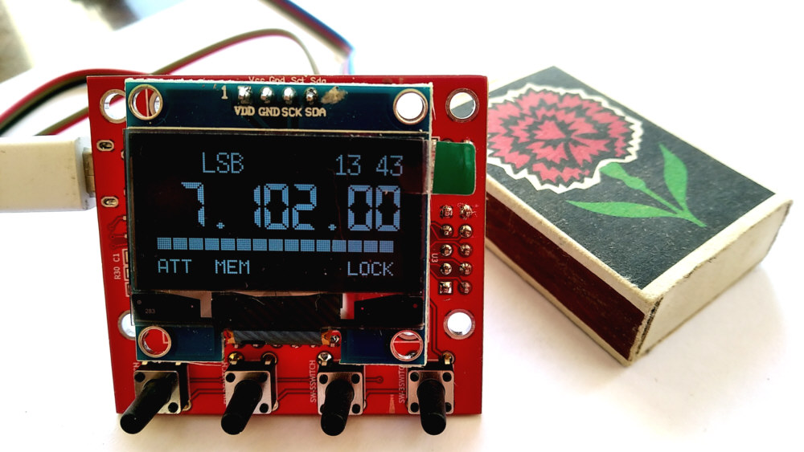
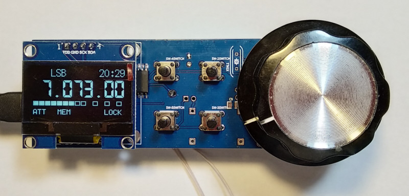
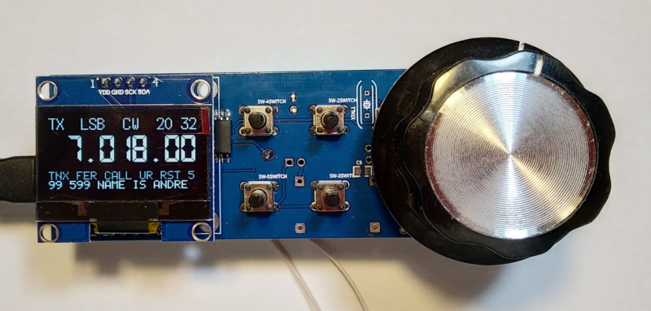

<h2>Nano VFO 3 - simple and powerfull digital VFO</h2>

Last event:
Version 3.4 from 12.07.2023 
- editable memory banks for CW messages 
- support for double superheterodyne architecture 
- temperature sensor LM35 
- measurement of SWR and power 
- TUNE mode 
- new SuperLED boards 
- updated documentation 

CPU: Atmega328P 
VFO: Si5351 and/or Si570 
Display: OLED 1.3" 128/132x64, OLED 0.96" 128x64 
Encoder: mechanic rotary encoder, AS5600 magnetic: 
Keypad: 4+1 buttons: 
Support different TRX architecture: 
- Single/double IF superheterodyne.
- Direct conversion with 2x or 4x output.
- Direct conversion with quadrature output.

Builtin CW key: auto/iambic mode, 3 phrase memory, morse decoder 
Major features: VFO A/B, SPLIT, calibrated S-meter, CAT protocol 
Control attenuator, LNA, 5 band BPF without decoder and 16 band with external decoder 

Project homepage http://www.ur5ffr.com/viewtopic.php?t=277 
Links to PCB: 
Version 3.1 https://oshwlab.com/ban.relayer/nano-vfo-3-1 
Version 3.2 https://oshwlab.com/ban.relayer/nano-vfo-3-2 
"Square" version https://oshwlab.com/ban.relayer/nano-vfo-3-1_copy 
SuperLED version will be available later after the victory in the war. Glory to Ukraine! 

Required libraries: 
 1. UR5FFR_Si5351 https://github.com/andrey-belokon/UR5FFR_Si5351
 2. SSD1306Ascii - install from Arduino IDE

</img>

</img>

</img>

</img>

</img>

</img>

Copyright (c) 2016-2023, Andrii Bilokon, UR5FFR 
http://www.ur5ffr.com 
License GNU GPL, see license.txt for more information