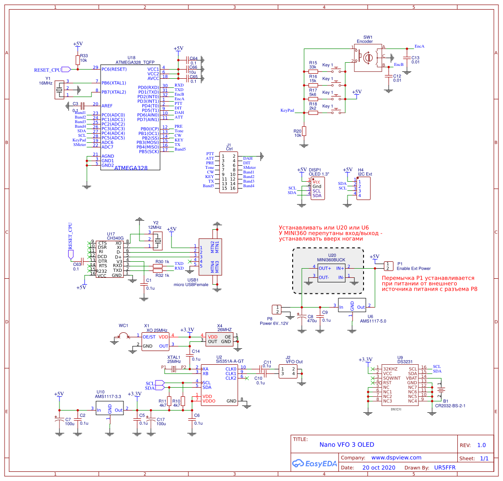

<h2>Nano VFO 3 - simple and powerfull digital VFO</h2>

Last event:
3 Feb 2021 added support for hardware version 3.1

CPU: Atmega328P 
PLL: Si5351 and/or Si570 
Display: OLED 1.3" 128/132x64, OLED 0.96" 128x64 
Encoder: mechanic rotary encode
Keypad: 4 buttons
Support different TRX architecture: 
 1. Single  IF superheterodyne.
 2. Direct conversion with 2x or 4x output.
 3. Direct conversion with quadrature output.

Builtin CW key: auto/iambic mode, 2 phrase memory, morse decoder 
VFOA/B, SPLIT, calibrated S-meter. Support CAT (KENWOOD protocol) 
Control attenuator, LNA, 5 band BPF without decoder and 16 band with external decoder 

Project homepage http://dspview.com/viewtopic.php?t=277 
PCB available here: https://oshwlab.com/ban.relayer/nano-vfo-3 

Required libraries: 
 1. UR5FFR_Si5351 https://github.com/andrey-belokon/UR5FFR_Si5351
 2. SSD1306Ascii - install from Arduino IDE

</img>

</img>

</img>

Copyright (c) 2016-2020, Andrii Bilokon, UR5FFR 
License GNU GPL, see license.txt for more information